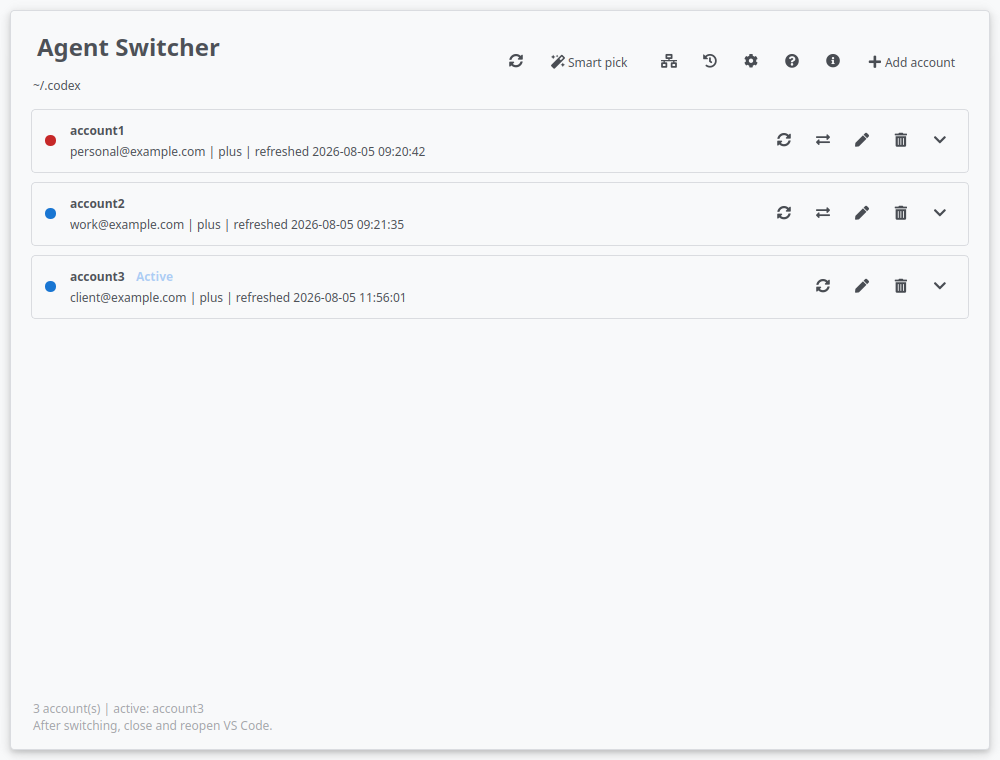
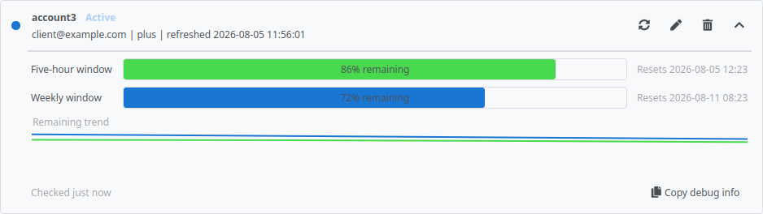

[🇬🇧 English](README.md) | 🇮🇷 فارسی

# Agent Switcher 🔄

**همه اکانت‌های Codex را یک‌جا نگه دارید، سهمیه باقی‌مانده را ببینید و در چند ثانیه بین آن‌ها جابه‌جا شوید.**

> 📌 **پشتیبانی فعلی:** Agent Switcher در حال حاضر فقط برای **OpenAI Codex** فعال است. پشتیبانی از ابزارهای برنامه‌نویسی دیگر برای نسخه‌های آینده برنامه‌ریزی شده است.

## چرا Agent Switcher؟ 🤔

خیلی از کاربران Codex بیشتر از یک اکانت دارند: یک اکانت شخصی، یکی برای محل کار، یکی برای مشتری یا اکانتی جدا برای یک پروژه دیگر. خارج‌شدن، ورود دوباره و به‌خاطر سپردن اینکه کدام اکانت هنوز سهمیه دارد، خیلی زود خسته‌کننده می‌شود.

یک مشکل پنهان هم وجود دارد. خارج‌شدن از Codex می‌تواند اطلاعات ورود ذخیره‌شده را بی‌اعتبار کند. خود Codex هم ممکن است اطلاعات ورود را در پس‌زمینه به‌روز کند. به همین دلیل، روش ساده «کپی‌کردن فایل ورود» ممکن است دقیقاً وقتی به آن نیاز دارید، از کار بیفتد.

Agent Switcher همه این کارها را خودکار انجام می‌دهد. پیش از تغییر اکانت یا شروع یک ورود جدید، آخرین وضعیت اکانت فعلی را به‌شکل امن ذخیره می‌کند. اگر ورود لغو شود یا خطا بخورد، اکانت قبلی دقیقاً مثل قبل برمی‌گردد. شما فقط اکانت را انتخاب می‌کنید و به کارتان ادامه می‌دهید. ✨

> 🔐 اکانت‌های ذخیره‌شده حاوی اطلاعات خصوصی ورود هستند. این فایل‌ها را هرگز به اشتراک نگذارید یا commit نکنید.

## قابلیت‌ها 🚀

### 👤 مدیریت اکانت‌ها

- ✅ اضافه‌کردن اکانت با ورود از طریق مرورگر
- ✅ اضافه‌کردن اکانت با کد یک‌بارمصرف
- ✅ تعویض اکانت با یک کلیک
- ✅ تغییر نام و حذف اکانت‌های ذخیره‌شده
- ✅ نمایش ایمیل، نوع پلن و زمان آخرین به‌روزرسانی
- ✅ بازگردانی اکانت قبلی پس از ورود ناموفق یا لغوشده
- ✅ هشدار هنگام در حال اجرا بودن Codex در زمان تعویض
- ✅ نمایش تاریخچه تعویض اکانت‌ها

### 📊 مصرف و سهمیه

- ✅ سهمیه باقی‌مانده پنج‌ساعته
- ✅ سهمیه باقی‌مانده هفتگی
- ✅ نوارهای رنگی سهمیه
- ✅ زمان شارژ مجدد و زمان آخرین بررسی
- ✅ نمودار کوچک تاریخچه مصرف
- ✅ به‌روزرسانی یک اکانت یا همه اکانت‌ها
- ✅ به‌روزرسانی خودکار هر ۱۵ دقیقه
- ✅ بررسی پس‌زمینه و روان، بدون قفل‌شدن برنامه
- ✅ وصل نگه‌داشتن اکانت‌های غیرفعال هنگام بررسی سهمیه
- ✅ هشدار کمبود سهمیه از طریق آیکون کنار ساعت
- ✅ نمایش پیام ساده «سهمیه در دسترس نیست» هنگام خطا
- ✅ تلاش خودکار دوباره برای خطاهای موقت اتصال و پروکسی

### 🧠 انتخاب هوشمند

- ✅ پیداکردن اکانتی با بهترین سهمیه قابل استفاده
- ✅ بررسی هم‌زمان محدودیت پنج‌ساعته و هفتگی
- ✅ استفاده از نتیجه‌های تازه قبلی برای جلوگیری از درخواست اضافی
- ✅ به‌روزرسانی نتیجه‌های قدیمی پیش از انتخاب
- ✅ به‌روزرسانی نتیجه‌های ناقص یا ناموفق پیش از انتخاب
- ✅ خودداری از انتخاب حدسی وقتی داده معتبر وجود ندارد

### 🖥️ دسکتاپ و آیکون کنار ساعت

- ✅ یک برنامه گرافیکی واحد برای Linux و Windows
- ✅ تعویض سریع از آیکون کنار ساعت
- ✅ نمایش اکانت فعال و سهمیه باقی‌مانده روی آیکون
- ✅ باقی‌ماندن برنامه کنار ساعت پس از بستن پنجره
- ✅ گزینه مشخص برای خروج از برنامه
- ✅ میانبر سراسری قابل تنظیم برای تعویض سریع
- ✅ پنجره کوچک تعویض سریع نزدیک آیکون
- ✅ استفاده بی‌دردسر از آیکون وقتی میانبر سراسری در دسترس نیست
- ✅ بررسی نسخه جدید، دانلود تأییدشده، نصب خودکار و اجرای دوباره نسخه مستقل از داخل برنامه

> ℹ️ میانبر سراسری روی Windows و Linux مبتنی بر X11 بهتر کار می‌کند. Wayland ممکن است آن را محدود کند، اما تعویض از آیکون کنار ساعت همچنان کار می‌کند.

### 🛡️ حریم خصوصی و کنترل

- ✅ حالت آفلاین برای قطع‌کردن همه بررسی‌های سهمیه
- ✅ اتصال مستقیم یا پروکسی HTTP دلخواه برای درخواست‌های برنامه
- ✅ بدون درخواست خودکار هنگام بازشدن برنامه، تا ابتدا بتوانید پروکسی را تنظیم کنید
- ✅ ادامه کار ورود و تعویض اکانت در حالت آفلاین
- ✅ پنل شفافیت شبکه
- ✅ فهرست روشن درخواست‌های ورود، بررسی سهمیه و به‌روزرسانی اکانت
- ✅ تاریخچه محلی با محدودیت خودکار حجم
- ✅ نادیده‌گرفتن اکانت‌های API key در بررسی سهمیه
- ✅ بررسی مسیر IP عمومی پیش از ورود، بررسی سهمیه و جابه‌جایی حساب
- ✅ نگهداری اثر انگشت IP جداگانه برای هر حساب، بدون ذخیره IP عمومی خام
- ✅ توقف مسیر تغییرکرده یا تأییدنشده پیش از درخواست OpenAI تا زمان تأیید صریح کاربر

محافظ IP یک بررسی سبک IP عمومی را از همان مسیر مستقیم یا پروکسی درخواست‌های OpenAI انجام می‌دهد و برای هر حساب فقط یک اثر انگشت کلیددار و محلی نگه می‌دارد. ترافیک GitHub مربوط به updater فعالیت حساب محسوب نمی‌شود. خود ورود مرورگری در مرورگر شما انجام می‌شود؛ بنابراین ممکن است مسیر متفاوتی از Codex CLI داشته باشد و Agent Switcher نمی‌تواند آن مسیر را اجبار کند.

### 🎨 شخصی‌سازی و دسترس‌پذیری

- ✅ تم تیره
- ✅ تم روشن
- ✅ تم خودکار سیستم
- ✅ رابط انگلیسی
- ✅ رابط فارسی با چیدمان راست‌به‌چپ
- ✅ فونت Vazirmatn همراه برنامه برای فارسی
- ✅ راهنمای شروع در اولین اجرا
- ✅ امکان نمایش دوباره راهنمای شروع و راهنمای هر بخش

### ⌨️ CLI

- ✅ دستور کوتاه `asw`
- ✅ نمایش، تعویض، اضافه، تغییر نام، حذف و بررسی اکانت‌ها
- ✅ نمایش جزئیات سهمیه با `asw list --details`
- ✅ خروجی JSON برای اسکریپت‌ها با `--json`
- ✅ بازکردن GUI با `asw gui`

## تصاویر 📸





## نصب 📦

Agent Switcher در حال حاضر از **Linux و Windows** پشتیبانی می‌کند. نسخه macOS هنوز ساخته یا آزمایش نشده و فعلاً پشتیبانی نمی‌شود.

برای اضافه‌کردن اکانت، Codex CLI باید نصب باشد. آن را با `npm install -g @openai/codex` نصب کنید. برنامه دسکتاپ علاوه بر `PATH`، مسیرهای معمول npm، NVM و فایل‌های اجرایی محلی را هم بررسی می‌کند.

Agent Switcher مقدار `cli_auth_credentials_store = "file"` را در `config.toml` مربوط به Codex تنظیم می‌کند. این کار لازم است چون جابه‌جایی حساب با جایگزینی امن `auth.json` انجام می‌شود و اعتبارنامه keyring سیستم‌عامل—به‌ویژه در Windows—نباید حساب انتخاب‌شده را نادیده بگیرد.

### نصب با pipx

در مسیری که این repository را دریافت کرده‌اید:

```shell
pipx install .
asw --version
asw gui
```

`pipx` روش پیشنهادی است، چون Agent Switcher و وابستگی‌های آن را از بقیه محیط Python جدا نگه می‌دارد.

### نصب با pip

Linux:

```shell
python3 -m venv .venv
source .venv/bin/activate
python -m pip install .
asw gui
```

Windows PowerShell:

```powershell
py -m venv .venv
.\.venv\Scripts\Activate.ps1
python -m pip install .
asw gui
```

### دانلود GUI آماده اجرا

صفحه [GitHub Releases](../../releases/latest) را باز کنید و فایل مناسب سیستم خود را دانلود کنید. فایل‌های Release مستقیماً GUI را باز می‌کنند. اگر به CLI با دستور `asw` نیز نیاز دارید، از `pipx` یا `pip` استفاده کنید.

Linux x86_64:

```shell
tar -xzf agent-switcher-linux-x86_64.tar.gz
chmod +x agent-switcher
./agent-switcher
```

Windows x86_64:

1. فایل `agent-switcher-windows-x86_64.exe` را دانلود کنید.
2. برای بازکردن Agent Switcher روی آن دوبار کلیک کنید.
3. برنامه فعلاً امضای دیجیتال ندارد. اگر Microsoft SmartScreen نمایش داده شد، **More info** و سپس **Run anyway** را انتخاب کنید.

## شروع سریع ⚡

نمایش اکانت‌های ذخیره‌شده:

```shell
asw list
```

تعویض اکانت:

```shell
asw switch <name>
```

بازکردن GUI:

```shell
asw gui
```

پس از بازکردن GUI، می‌توانید پنجره اصلی را ببندید و Agent Switcher را در system tray آماده نگه دارید.

## به‌زودی 🛠️

قابلیت‌های زیر برای آینده برنامه هستند و **در نسخه فعلی وجود ندارند**:

- 🔜 ذخیره امن اکانت‌ها با keyring سیستم‌عامل
- 🔜 افزونه VS Code برای تعویض بدون بازکردن مجدد
- 🔜 پشتیبانی از اکانت‌های Claude Code
- 🔜 یک `CODEX_HOME` جدا برای هر اکانت

## استفاده مسئولانه 🤝

Agent Switcher برای مدیریت اکانت‌های جدا، مثل اکانت شخصی و کاری، ساخته شده است. هدف آن دورزدن محدودیت مصرف provider نیست. کاربران باید از این ابزار مطابق شرایط استفاده OpenAI استفاده کنند.

## مشارکت 🛠️

Issue، pull request‌های متمرکز، تست، بهبود مستندات و بررسی برنامه روی Linux یا Windows مورد استقبال هستند. لطفاً هرگز فایل ورود یا token واقعی را در Issue یا commit قرار ندهید.

## مجوز 📄

Agent Switcher با [مجوز MIT](LICENSE) منتشر می‌شود.
